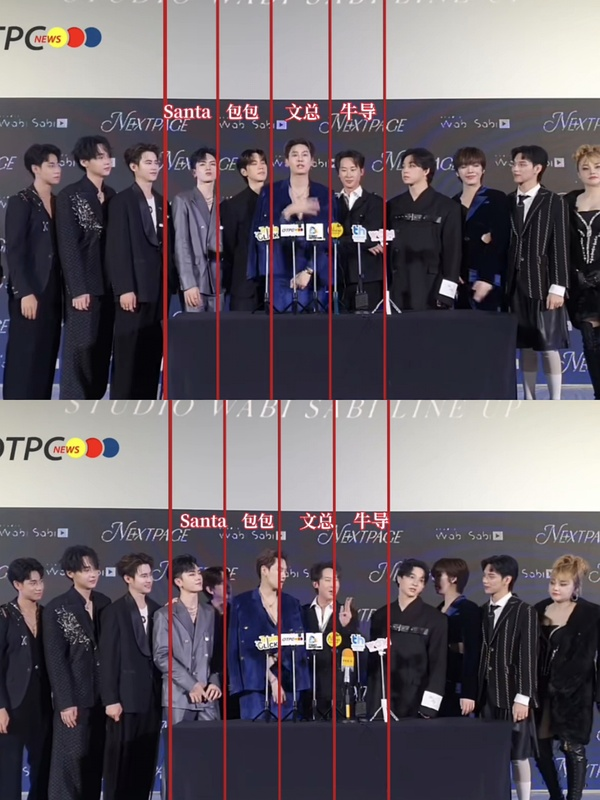

# PS006｜采访时三塔挤包包

## 复核问题

> 采访时三塔挤包包。

## 复核结论

假❗三塔全程没动，是右边来人，集体往左边移动，包包自己退到后排。

对比前后画面中的固定红线可以看到：三塔的位置没有发生挤人的横向移动；变化来自右侧人员加入后队伍整体向左调整，包包随后退到后排。

---

原始讨论：[豆瓣帖子](https://www.douban.com/group/topic/496556148/) · 归档日期：2026-08-13
