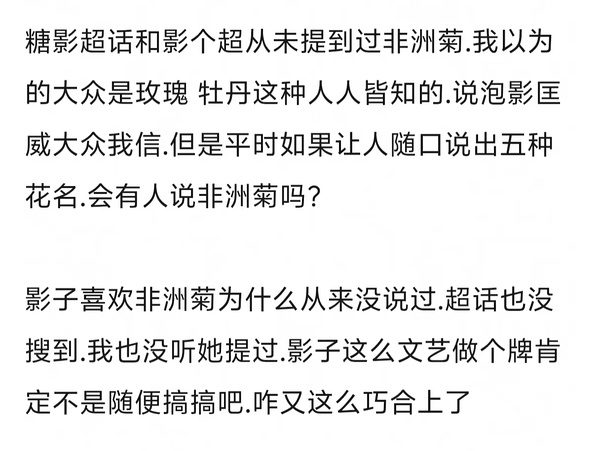
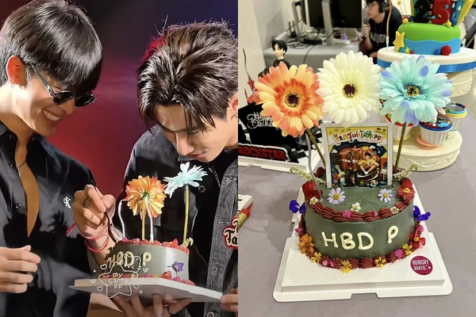
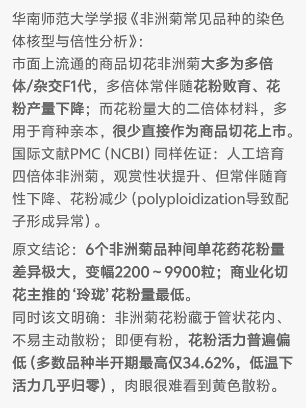

# PS009｜生日蛋糕与非洲菊造谣恋情

## 复核问题

> 造谣恋情🍉

## 复核结论

纯主观臆测文字强行瞎扯❗️

1. 蛋糕和花是店里没有的款式，三塔亲自设计预订的。（我想有些人既然已经看到了蛋糕和花，应该不会没看到是谁送的以及送的寓意是什么吧，刻意忽略这个其实是泡塔生日会🍬点，用春秋笔法进行造谣，好恶毒的心思。）
2. 塔塔在王俊勇生日会当面送上，插了三朵花。非洲菊寓意是：“我希望今年你能被所有人爱着、珍惜着。我见过你无数次为别人祈祷，所以这次，也希望你能好好祝福自己。希望你遇到的都是让你快乐的事情。这个蛋糕是我满怀心意为你准备的。（虽然不是我亲手做的，但我有很多创意！）另外，我在照片下面藏了个小惊喜，请你试着把它拿出来。小心点，上面可能有蛋糕哦，哥……我不知道该买什么，所以就准备了这个，希望你能买到自己真正喜欢的东西。哥，我爱你！🤟🏻”（这个三塔屁屁就是小天使😘）

补充：王俊勇花粉过敏，而非洲菊花粉含量极少，所以塔塔选择了送非洲菊。

相关链接：

- [蛋糕和花的设计及寓意](https://weibo.com/5976906130/5280806484578902)
- [生日会现场发言](https://weibo.com/1863122807/5278542104625517)

参考文献：

1. 陈玮婷、夏朝水、陈昌铭、曹奕鸯：《6 个非洲菊品种的花粉特性及其离体萌发》，《热带生物学报》2020 年第 11 卷第 4 期，455–460，DOI：10.15886/j.cnki.rdswxb.2020.04.008。
2. 李顺、王亚琴：《非洲菊常见品种的染色体核型与倍性分析》，《华南师范大学学报（自然科学版）》2016 年第 48 卷第 6 期，13–18。

---

原始讨论：[豆瓣帖子](https://www.douban.com/group/topic/496556148/) · 归档日期：2026-08-19
