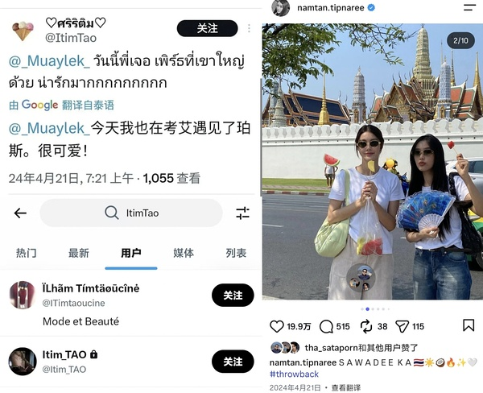

# PS010｜考艾同游造谣恋情

## 复核问题

> 王俊勇与某泰百女考艾同游（造谣恋情🍉）

## 复核结论

1. 所谓王俊勇在 2024 年 4 月 21 日在考艾旅游的证据，全网仅此一条转发量为 2 的文字爆料，且该账号早已注销，无从查证真伪。
2. 2024 年 4 月 21 日当天，被造谣的另一位当事人与搭子正在曼谷大皇宫景点同游中。

---

原始讨论：[豆瓣帖子](https://www.douban.com/group/topic/496556148/) · 归档日期：2026-08-19
