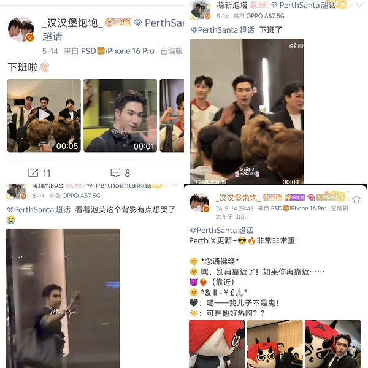
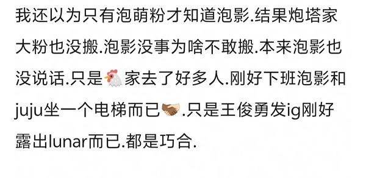

# PS011｜活动后同乘电梯造谣恋情

## 复核问题

> 泡萌粉刻意不搬下班视频，掩盖三人同乘电梯？

## 复核结论

典型的“带着结论找问题”式造谣，先预设造谣结果成立，再带有色眼镜使用春秋笔法话术将原本再正常不过的事修饰成“恋情实锤”。

1. 泡塔粉当天全部正常搬运上下班视频、王俊勇发布的社媒，并无任何刻意遗漏。
2. 造谣内容为提升自己臆测可信度，刻意忽略同部电梯内总人数，只单纯指出有包括被造谣当事方在内的三人，企图让人误会电梯内仅有此三人。但是据视频来看，实际上电梯内多达至少 10 人同乘。

那么去掉造谣文案的这些阴阳怪气和春秋笔法，再来形容这件事就是：KAZZ 颁奖典礼结束后，包括 GMM 家艺人 Perth、Ju、Film 在内的十几人共乘电梯下楼，然后离开活动现场。

相关链接：[同乘电梯现场视频](https://weibo.com/5677128614/5298776698781765)

---

原始讨论：[豆瓣帖子](https://www.douban.com/group/topic/496556148/) · 归档日期：2026-08-19
